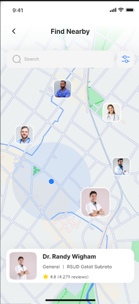

# 🏥 Doc Doc App

**Doc Doc App** is a mobile application that helps patients easily find nearby doctors, view their profiles, check ratings & reviews, and locate them on an interactive map.  
It aims to make the process of finding and booking medical appointments **faster, easier, and more reliable**.

---

## 📌 Features
- 🔍 **Search & Browse**: Find doctors by specialty, location, or name.
- ⭐ **Ratings & Reviews**: Check other patients’ feedback before booking.
- 📍 **Location Integration**: View doctors’ clinics on an interactive map.
- 📅 **Appointment Booking**: Book consultations directly from the app *(if enabled)*.
- 👤 **Profile Management**: Patients and doctors can manage their profiles.

---

## 🖼️ Screenshots


| Splash Screen                      | Home Screen |  Profile                      | Map View                        |
|------------------------------------|-------------|-------------------------------------|------------------------------|
|  |  |  |  |

---

## 🛠️ Tech Stack
- **Framework**: Flutter
- **State Management**: Bloc / Cubit *(or specify your choice)*
- **Backend**: REST API
- **Maps**: Google Maps API
- **Platform**: Android & iOS

---

## 🚀 Getting Started

### Prerequisites
- Install [Flutter SDK](https://flutter.dev/docs/get-started/install)
- Install Android Studio or VS Code with Flutter extensions
- Enable Google Maps API in your Google Cloud Console

### Installation
```bash
# Clone this repository
git clone https://github.com/username/appointment_app.git

# Go into the project folder
cd appointment_app

# Get dependencies
flutter pub get

# Run the app
flutter run

🌐 API Configuration
const String baseUrl = "https://vcare.integration25.com/api/";

✨ Author
Developed by Marwan Yasser ElSokary
📧 Email: marwanelsokary12234@gmail.com
